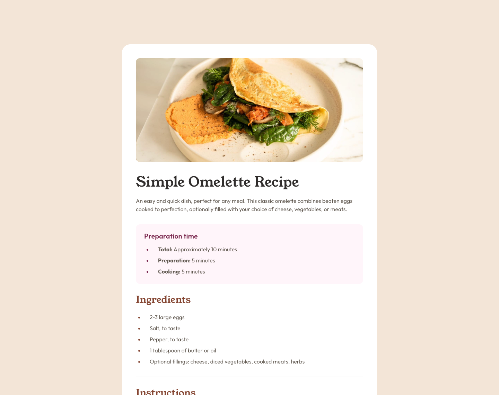

# Frontend Mentor - Recipe page solution

This is a solution to the [Recipe page challenge on Frontend Mentor](https://www.frontendmentor.io/challenges/recipe-page-KiTsR8QQKm).
Frontend Mentor challenges help you improve your coding skills by building realistic projects

## Table of contents

- [Overview](#overview)
  - [The challenge](#the-challenge)
  - [Screenshot](#screenshot)
  - [Links](#links)
- [My process](#my-process)
  - [Built with](#built-with)
  - [What I learned](#what-i-learned)
  - [Useful resources](#useful-resources)
- [Author](#author)

## Overview

### The challenge
Build out this recipe page and get it looking as close to the design as possible.

Users should be able to:
- View the optimal layout depending on their device's screen size
- See hover and focus states for interactive elements

### Screenshot

### Links

- Solution URL: [https://github.com/alkersan/recipe-page](https://github.com/alkersan/recipe-page)
- Live Site URL: [https://alkersan.github.io/recipe-page/](https://alkersan.github.io/recipe-page/)

## My process

### Built with

- Mobile first
- [React](https://react.dev) - JS library
- [Styled Components](https://styled-components.com/) - For CSS
- [Vite](https://vitejs.dev) - Build tool

### What I learned
- tables are tricky to style - I couldn't reproduce all the spacings as in the design
- in one of the reviews of this exercise it was mentioned that it can be done without media queries.
But how to tackle the transition from padded rounded view on tablets to a fully snapped one on mobile?

### Useful resources
 - The course [css-for-js](https://css-for-js.dev) helped me immensely.
 - [clamp() calculator](https://chrisburnell.com/clamp-calculator/)   

## Author

- Frontend Mentor - [@alkersan](https://www.frontendmentor.io/profile/alkersan)
